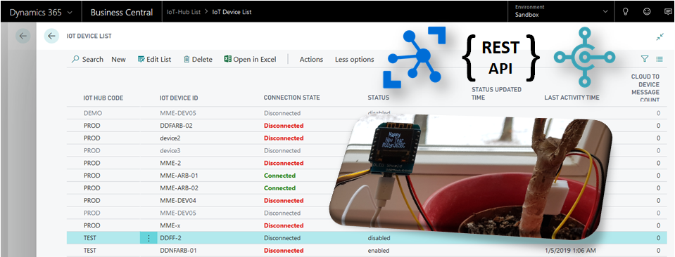
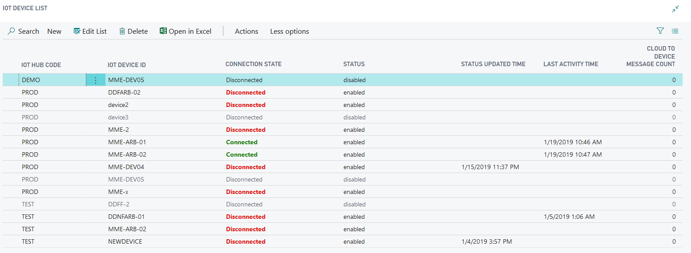
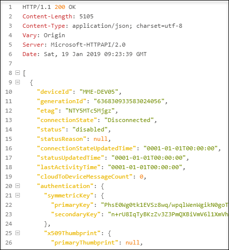
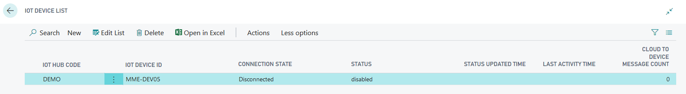
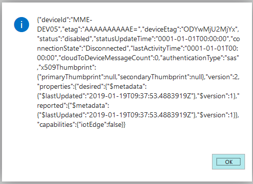

# MSDyn365BC-IoTHub-REST-API

IoT is an important part of our current technology. With **Azure IoT Hub** we are able to start as quick as possible. This platform allows to connect, configure and manage IoT Devices, IoT Edge Devices, Device Twins, Configurations and much more.



My example show the integration of IoT Hub functionality in **Microsoft Dynamics 365 Business Central** by using the **IoT Hub Rest API**. *Well you might do this in CAL or C/Side*, but I want to show the future and with MSDyn365BC I use the new development language **Microsoft AL**!

IoT Hub **Rest API** means, we have to send and receive Http-Messages and content. For this Microsoft AL introduced several new object types and some are:

**Http-Objects:**

* HttpClient
* HttpRequestMessage
* HttpResponseMessage
* HttpContent
* HttpHeaders

**Json-Objects:**

* JsonObject
* JsonArray
* JsonToken
* JsonValue

Another new things in Microsoft AL are **Enum**'s. My example uses this object type as a *strong typed* parameter for some methods.

***Disclaimer:*** ...please keep in mind, this example does not cover every aspects and **is provided "AS IS"**. Feel free to improve, contribute, use this example as an inspiration or contact me, if you have some ideas ;)

## IoT Hub API in MSDyn365BC



The main parts of my example are:

| Type | Name | Description |
|-|-|-|
|Enum|"MME IoT API"|Specify the API call (used as parameter).|
|Table|"MME IoT Hub"|Store information to access the IoT Hub (Uri and Authorization Token).|
|Table|"MME IoT Device"|Store information about IoT Devices (ID and related IoT Hub).|
|Codeunit|"MME IoT API Utils"|Prepare `HttpClient` and `HttpRequestMessage` for the API call.|
|Codeunit|"MME IoT Management"|Methods to call the IoT Hub Rest API.|

## Enum "MME IoT API"

The `enum` object in Microsoft AL is much more than an option. It contains important information for the UI (`Caption`, ...), can be used as parameters and can be extended by an `EnumExtension` if needed.

My example uses this object type to specify the respective IoT Hub Rest API method:

```js
enum 50130 "MME IoT API"
{
    Extensible = true;

    value(0; GetDevices) { }
    value(1; GetDevice) { }
    value(2; CreateOrUpdateDevice) { }
    value(3; DeleteDevice) { }
    // ...
}
```

In my opinion an enum as method parameter document the parameter content much better than an option:

```js
// Enum as method parameter
procedure Prepare(client: HttpClient; hubCode: Code[20]; id: Text; api: Enum "MME IoT API"; ifMatch: Text)
begin
    // ...
end;

procedure GetDevice(var device: Record "MME IoT Device") deviceJson: Text
var
    api: Enum "MME IoT API";
    // ...
begin
    // specify the right value of the parameter
    api := api::GetDevice;
    // ...
    Prepare(client, hubCode, id, api);
    // ...
end;
```

Finally the usage of enums in `case ... of` statements is similar to an option. One of the best things are, `caption` properties can be implemented direct in the object and all instances just reference this type.

## Table "MME IoT Hub"

*A place to store IoT Hub's.* **Table** `"MME IoT Hub"` contains information about the Azure IoT Hub's and this are:

* Code (Identification of the IoT Hub)
* Uri
* Shared Access Key

## Codeunit "MME IoT API Utils"

`"MME IoT API Utils"` prepare `HttpClient`and `HttpRequestMessage` for the API call and act as a wrapper to simplify coding for business cases.

### Prepare the HttpClient

The **IoT Hub Rest API** is very simple. You have to specify the base Uri of your Azure IoT Hub, followed by the entity name and in some cases an optional ID. What you need is mostly this:

    URL: "<IoT-Hub-Uri>/<Entity>/<Id>?<api-version=2018-06-30>"

Each call of the IoT Hub API must to be authorized. In some cases, a `Match-If` must be specified for the `HttpHeaders`. Uri and Authorization token are used from table `MME IoT Hub` - identified by `hubCode`. All other parameters should be passed to the `Prepare` method for the `HttpClient`.

```js
procedure Prepare(client: HttpClient; hubCode: Code[20]; id: Text; api: Enum "MME IoT API"; ifMatch: Text)
var
    hub: Record "MME IoT Hub";
begin
    if not hub.Get(hubCode) then exit;
    if (hub."IoT Hub Uri" = '') or (hub."Authorization Token" = '') then exit;
    Clear(client);
    client.DefaultRequestHeaders().Add('Authorization', hub."Authorization Token");

    if ifMatch <> '' then
        client.DefaultRequestHeaders().Add('If-Match', ifMatch);

    // The URL's of the IoT Hub REST API
    case api of
        api::GetDevices:
            client.SetBaseAddress(StrSubstNo('%1/devices?api-version=2018-06-30', hub."IoT Hub Uri"));

        api::GetDevice,
        api::CreateOrUpdateDevice,
        api::DeleteDevice:
            client.SetBaseAddress(StrSubstNo('%1/devices/%2?api-version=2018-06-30', hub."IoT Hub Uri", id));

        api::GetConfiguration,
        api::CreateOrUpdateConfiguration,
        api::DeleteConfiguration:
            client.SetBaseAddress(StrSubstNo('%1/configurations/%2?api-version=2018-06-30', hub."IoT Hub Uri", id));

        api::GetTwin,
        api::UpdateTwin,
        api::ReplaceTwin:
            client.SetBaseAddress(StrSubstNo('%1/twins/%2?api-version=2018-06-30', hub."IoT Hub Uri", id));

        api::InvokeDeviceMethod:
            client.SetBaseAddress(StrSubstNo('%1/twins/%2/methods?api-version=2018-06-30', hub."IoT Hub Uri", id));
    end;
end;
```

_This method setup the `HttpClient` header information, `Match-If` and the respective Url for the call._

### Prepare the HttpRequestMessage

The structure and message content for each API calls are specified at:
[**IoT Hub API Reference**](https://docs.microsoft.com/en-us/rest/api/iothub/)

`HttpRequestMessage` support the Http operations (`GET`, `POST`, `PUT`, `PATCH` and `DELETE`). The expected message content type is `Json` and must be specified in the message header. 

*I have learned, it's importand to use the right order of the AL commands. Internally, the `HttpContent` might reset the `Content-Type`, when `.WriteFrom(...)` is called*

```js
procedure Prepare(request: HttpRequestMessage; api: Enum "MME IoT API"; json: Text)
var
    headers: HttpHeaders;
    content: HttpContent;
begin
    // Prepare the request (Content, Header & Method)
    case api of
        api::CreateOrUpdateDevice,          // https://docs.microsoft.com/en-us/rest/api/iothub/service/createorupdatedevice
        api::CreateOrUpdateConfiguration,   // https://docs.microsoft.com/en-us/rest/api/iothub/service/createorupdateconfiguration
        api::ReplaceTwin:                   // https://docs.microsoft.com/en-us/rest/api/iothub/service/replacetwin
            begin
                // Assign the Json-Content
                content.WriteFrom(json);
                // Change of the message header must be here, because writing the content may reset these header to: "Text/Plain"
                content.GetHeaders(headers);
                headers.Remove('Content-Type');
                headers.Add('Content-Type', 'application/json');
                // Assign the content & HTTP-Method
                request.Content(content);
                request.Method('PUT');
            end;

        api::DeleteDevice,                  // https://docs.microsoft.com/en-us/rest/api/iothub/service/deletedevice
        api::DeleteConfiguration:           // https://docs.microsoft.com/en-us/rest/api/iothub/service/deleteconfiguration
            request.Method('DELETE');

        api::GetDevices,                    // https://docs.microsoft.com/en-us/rest/api/iothub/service/getdevices
        api::GetDevice,                     // https://docs.microsoft.com/en-us/rest/api/iothub/service/getdevice
        api::GetConfiguration,              // https://docs.microsoft.com/en-us/rest/api/iothub/service/getconfiguration
        api::GetTwin:                       // https://docs.microsoft.com/en-us/rest/api/iothub/service/gettwin
            request.Method('GET');

        api::UpdateTwin:                    // https://docs.microsoft.com/en-us/rest/api/iothub/service/updatetwin
            begin
                // Assign the Json-Content
                content.WriteFrom(json);
                // Change of the message header must be here, because writing the content may reset these header to: "Text/Plain"
                content.GetHeaders(headers);
                headers.Remove('Content-Type');
                headers.Add('Content-Type', 'application/json');
                // Assign the content & HTTP-Method
                request.Content(content);
                request.Method('PATCH');
            end;

        api::InvokeDeviceMethod:
            begin
                // Assign the Json-Content
                content.WriteFrom(json);
                // // Change of the message header must be here, because writing the content may reset these header to: "Text/Plain"
                // content.GetHeaders(headers);
                // headers.Remove('Content-Type');
                // headers.Add('Content-Type', 'application/json');
                // Assign the content & HTTP-Method
                request.Content(content);
                request.Method('POST');
            end;
    end;
end;
```

## Codeunit "MME IoT Management" - Call the API

A good starting point is to query the IoT Devices from IoT Hub. For this example I have added the tables `MME IoT Device` and `MME IoT Device Status`. Table `MME IoT Device` can also be used, to add new devices and create them later with API method `CreateOrUpdateDevice`. Table `MME IoT Device Status` is used temporary to store runtime information of IoT devices collected from Azure IoT Hub.

To get information about all devices from Azure IoT Hub - we need to call [API GetDevices](https://docs.microsoft.com/en-us/rest/api/iothub/service/getdevices).

**Simulation with Http-RestClient:**

    @hubUri   = https://<IoT-Hub-Name>.azure-devices.net
    @sasToken = sr=iot0815...<Full SAS Token from Azure IoT Hub)...

    ### Get Azure IoT Hub Devices
    GET {{hubUri}}/devices?api-version=2018-06-30
    Authorization: SharedAccessSignature {{sasToken}}

The following method shows, how `Prepare` methods are used. When `HttpClient` and `HttpRequestMethod` are filled with information, `client.Send(request, response)` will call the Azure IoT Hub, which returns `Json` in the `HttpContent` of `HttpResponseMessage` *(or sometimes an error)*

```js
procedure GetDevices(hubCode: Code[20]) devicesJson: Text
var
    api: Enum "MME IoT API";
    client: HttpClient;
    response: HttpResponseMessage;
    request: HttpRequestMessage;
begin
    api := api::GetDevices;

    iotUtils.Prepare(client, hubCode, api);
    iotUtils.Prepare(request, api);

    if not client.Send(request, response) then exit;
    if not response.IsSuccessStatusCode() then begin
        HandleError(response);
        exit;
    end;
    if not response.Content().ReadAs(devicesJson) then exit;
    exit(devicesJson);
end;

```



Finally, the `Json` is parsed and the information are copied into the tables `MME IoT Device` and `MME IoT Device Status`. The result is:



## IoT Devices in Business Central

When IoT Hub's are added and configured, existing IoT Devices can be imported. For this I prepared the an action in the page `MME IoT Device List`:

```js
action(ImportDevices)
{
    Caption = 'Import from IoT Hub';
    Image = Import;
    Promoted = true;
    ApplicationArea = All;
    PromotedIsBig = true;

    trigger OnAction()
    var
        mgt: Codeunit "MME IoT Management";
    begin
        mgt.ImportDevices(Rec, mDeviceStatus);
        CurrPage.Update(false);
    end;
}
```

Other actions allow to ***Enabled / Disabled*** the device or get and show the configuration of the IoT Device Twin.

**IoT Device Twin information:**



```json
{
    "deviceId": "MME-DEV05",
    "etag": "AAAAAAAAAAE=",
    "deviceEtag": "ODYwMjU2MjYx",
    "status": "disabled",
    "statusUpdateTime": "0001-01-01T00:00:00",
    "connectionState": "Disconnected",
    "lastActivityTime": "0001-01-01T00:00:00",
    "cloudToDeviceMessageCount": 0,
    "authenticationType": "sas",
    "x509Thumbprint": {
        "primaryThumbprint": null,
        "secondaryThumbprint": null
    },
    "version": 2,
    "properties": {
        "desired": {
            "$metadata": {
                "$lastUpdated": "2019-01-19T09:37:53.4883919Z"
            },
            "$version": 1
        },
        "reported": {
            "$metadata": {
                "$lastUpdated": "2019-01-19T09:37:53.4883919Z"
            },
            "$version": 1
        }
    },
    "capabilities": {
        "iotEdge": false
    }
}
```